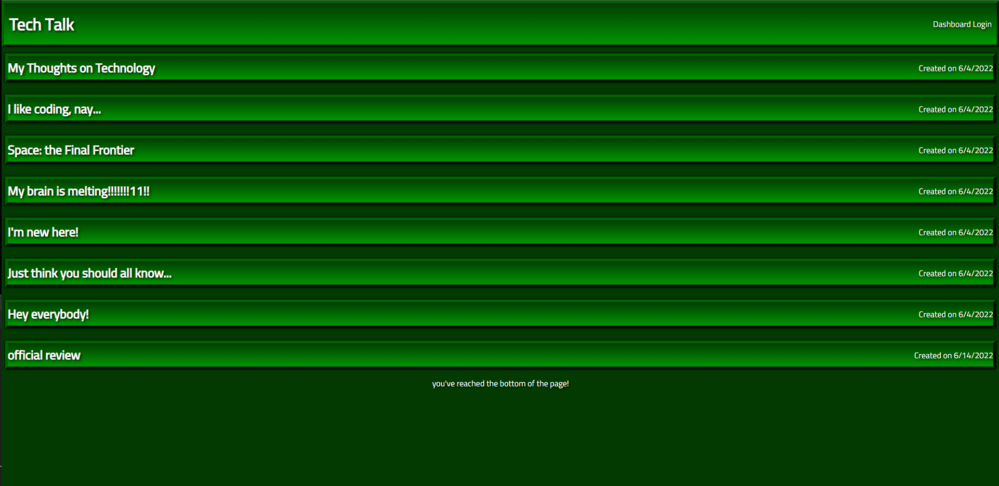

# Tech Blog



Check out the App [here](https://tech-blog-social-platform.herokuapp.com/)

## Description

Why did you decide to build this project?

```
In this project, I wanted to demonstrate my knowledge of CRUD routes and databases, through the use of interconnected tables and data-persistance with session-storage.

To do this, I have set up a pseudo-social media platform to make posts about coding! Here you can create an account, check other people's posts/comments, and even make your own posts on the platform.
```

## Table of Contents

- [Installation](#installation)
- [Usage](#usage)
- [Contributing](#contributing)
- [Tests](#tests)
- [Questions](#questions)

## Installation

How to install:

```
In order to install this project:

-Go to the github page through the README hyperlink at the bottom of the page,
-Click on the green 'code' button and select the 'SSH clone' option,
-Open the terminal on your local machine, directing yourself to where you would like the project to be saved,
-Type 'git clone ' and paste the link copied to your clipboard.
-Hit Enter!

Now that you have saved it to your local machine;

-Open the terminal at the root of the project, and type 'npm i' to download your dependencies,
-Follow the instructions in youe .env.EXAMPLE file,
-Activate the schema database throught MySql; type 'source db/schema.sql' to create the database,
-Type 'node seeds/seed' to seed your database,
-Type 'node server' and hit Enter!

After going to your browser and type 'http://localhost:3001/', and you'll see the project website!

```

## Usage

How does your project work?

```
Like most social-media platforms, this site to allow to use CRUD routes; create posts/comments, get post/comments/pages, update posts, and delete posts. Becaause this site saves data to a database, any info you add/update/delete will persist, even after you log off!

This works through the use of controllers; js files that handle all of the CRUD routes.
Handlebars are also being used; and get requests are made, handlebars cycles to templates to render the one queried!
```

## Contributing

How can you contribute to this project?

```
If you want to contribute; feel free to tinker with the code!
If you find any convoluted/unecessary code in the program; point it out! I would love to hear what I can improve.
You can reach out to me at the email listed below!
```

## Tests

To run this program:

```
This is the code for updating posts; it gave me the most grief!

const updateButtonHandler = async (event) => {
  event.preventDefault();

  const description = document.querySelector("#update-desc").value.trim();
  const id = document.querySelector('input[name="update-id"]').value;
  const title = document.querySelector("#update-title").value.trim();

  console.log(description);
  console.log(id);
  console.log(title);

  if (description) {
    const response = await fetch(`/api/posts/${id}`, {
      method: "PUT",
      body: JSON.stringify({ description, id, title }),
      headers: {
        "Content-Type": "application/json",
      },
    });
    console.log(response);
    if (response.ok) {
      document.location.replace("/dashboard");
    } else {
      alert("Oops! There was an issue commenting on this post!");
    }
  }
};

document
  .querySelector(".update-list")
  .addEventListener("submit", updateButtonHandler);
```

## Questions

If you have any questions, you can contact me through:

- [Github](https://github.com/Loggamon)
- Email: scarletfedora@gmail.com

## License & Copyright

© Logan Monson
